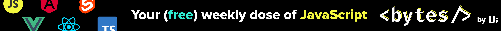
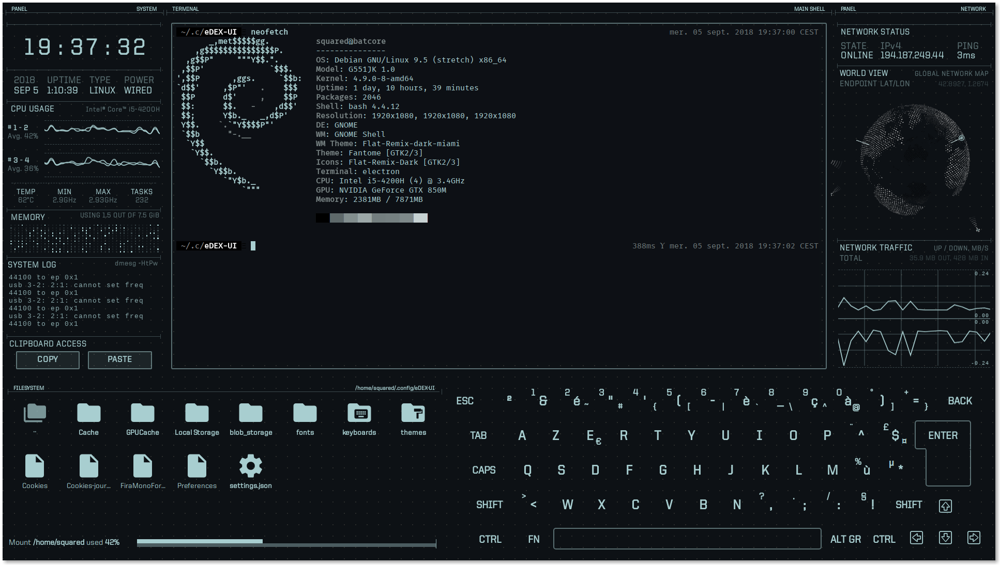
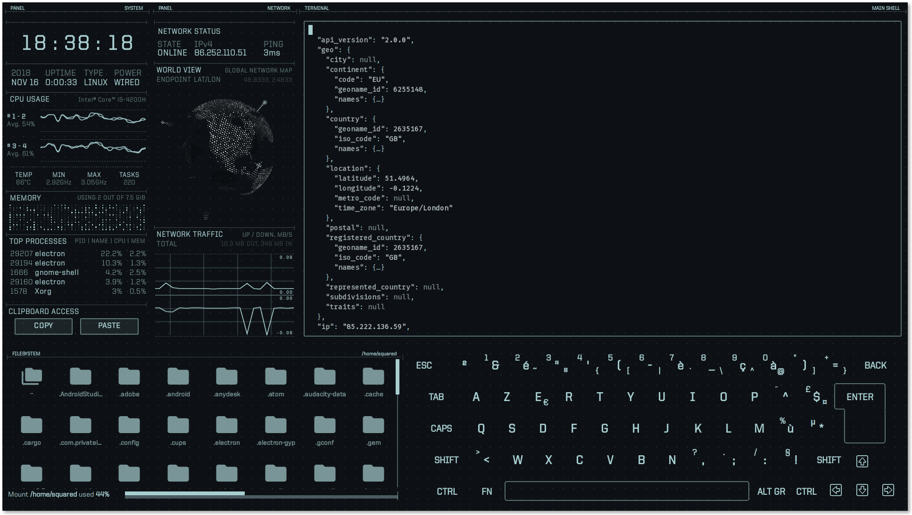
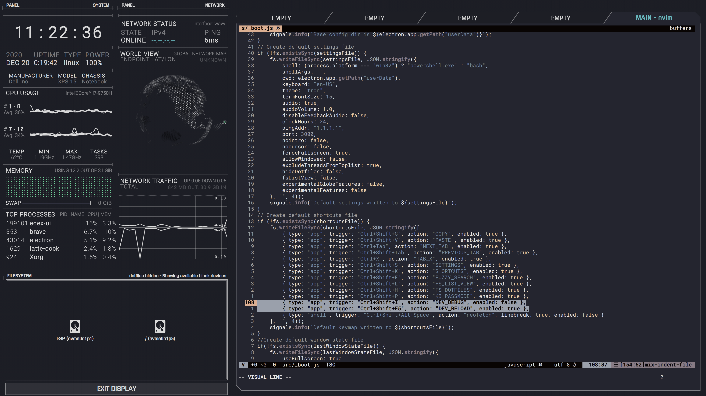

   
  
    
  
   
  
  
  
   
  
  
  
  
  
   
  <a href="https://github.com/GitSquared/edex-ui/releases/tag/v2.2.8"><strong><i>(Project archived oct. 18th 2021)</i></strong></a>
     

eDEX-UI is a fullscreen, cross-platform terminal emulator and system monitor that looks and feels like a sci-fi computer interface.

---

Heavily inspired from the [TRON Legacy movie effects](https://web.archive.org/web/20170511000410/http://jtnimoy.com/blogs/projects/14881671) (especially the [Board Room sequence](https://gmunk.com/TRON-Board-Room)), the eDEX-UI project was originally meant to be *"[DEX-UI](https://github.com/seenaburns/dex-ui) with less « art » and more « distributable software »"*.

While keeping a futuristic look and feel, it strives to maintain a certain level of functionality and to be usable in real-life scenarios, with the larger goal of bringing science-fiction UXs to the mainstream.

 

It might or might not be a joke taken too seriously.

---

  <em>Jump to:  <a href="#features">Features</a> — <a href="#screenshots">Screenshots</a> — <a href="#qa">Questions & Answers</a> — <strong><a href="#how-do-i-get-it">Download</a></strong> — <a href="#featured-in">Featured In</a> — <a href="#useful-commands-for-the-nerds">Contributor Instructions</a> — <a href="#credits">Credits</a></em>

## Sponsor

**Want to help support my open-source experiments and learn some cool JavaScript tricks at the same time?**

Click the banner below and sign up to **Bytes**, the only newsletter cool enough to be recommended by eDEX-UI.

## Features
- Fully featured terminal emulator with tabs, colors, mouse events, and support for `curses` and `curses`-like applications.
- Real-time system (CPU, RAM, swap, processes) and network (GeoIP, active connections, transfer rates) monitoring.
- Full support for touch-enabled displays, including an on-screen keyboard.
- Directory viewer that follows the CWD (current working directory) of the terminal.
- Advanced customization using themes, on-screen keyboard layouts, CSS injections. See the [wiki](https://github.com/GitSquared/edex-ui/wiki) for more info.
- Optional sound effects made by a talented sound designer for maximum hollywood hacking vibe.

## Screenshots

_[neofetch](https://github.com/dylanaraps/neofetch) on eDEX-UI 2.2 with the default "tron" theme & QWERTY keyboard_

_Checking out available themes in [eDEX's config dir](https://github.com/GitSquared/edex-ui/wiki/userData) with [`ranger`](https://github.com/ranger/ranger) on eDEX-UI 2.2 with the "blade" theme_

_[cmatrix](https://github.com/abishekvashok/cmatrix) on eDEX-UI 2.2 with the experimental "tron-disrupted" theme, and the user-contributed DVORAK keyboard_

_Editing eDEX-UI source code with `nvim` on eDEX-UI 2.2 with the custom [`horizon-full`](https://github.com/GitSquared/horizon-edex-theme) theme_

## Q&A
#### How do I get it?
Click on the little badges under the eDEX logo at the top of this page, or go to the [Releases](https://github.com/GitSquared/edex-ui/releases) tab, or download it through [one of the available repositories](https://repology.org/project/edex-ui/versions) (Homebrew, AUR...).

Public release binaries are unsigned ([why](https://gaby.dev/posts/code-signing)). On Linux, you will need to `chmod +x` the AppImage file in order to run it.
#### I have a problem!
Search through the [Issues](https://github.com/GitSquared/edex-ui/issues) to see if yours has already been reported. If you're confident it hasn't been reported yet, feel free to open up a new one. If you see your issue and it's been closed, it probably means that the fix for it will ship in the next version, and you'll have to wait a bit.
#### Can you disable the keyboard/the filesystem display?
You can't disable them (yet) but you can hide them. See the `tron-notype` theme.
#### Why is the file browser saying that "Tracking Failed"? (Windows only)
On Linux and macOS, eDEX tracks where you're going in your terminal tab to display the content of the current folder on-screen.
Sadly, this is technically impossible to do on Windows right now, so the file browser reverts back to a "detached" mode. You can still use it to browse files & directories and click on files to input their path in the terminal.
#### Can this run on a Raspberry Pi / ARM device?
We provide prebuilt arm64 builds. For other platforms, see [this issue comment](https://github.com/GitSquared/edex-ui/issues/313#issuecomment-443465345), and the thread on issue [#818](https://github.com/GitSquared/edex-ui/issues/818).
#### Is this repo actively maintained?
No, after a 3 years run, this project has been archived. See the [announcement](https://github.com/GitSquared/edex-ui/releases/tag/v2.2.8).
#### How did you make this?
Glad you're interested! See [#272](https://github.com/GitSquared/edex-ui/issues/272).
#### This is so cool.
Thanks! If you feel like it, you can [follow me on Twitter](https://gaby.dev/twitter) to hear about new stuff I'm making.

## Featured in...
- [Linux Uprising Blog](https://www.linuxuprising.com/2018/11/edex-ui-fully-functioning-sci-fi.html)
- [My post on r/unixporn](https://www.reddit.com/r/unixporn/comments/9ysbx7/oc_a_little_project_that_ive_been_working_on/)
- [Korben article (in french)](https://korben.info/une-interface-futuriste-pour-vos-ecrans-tactiles.html)
- [Hacker News](https://news.ycombinator.com/item?id=18509828)
- [This tweet that made me smile](https://twitter.com/mikemaccana/status/1065615451940667396)
- [BoingBoing article](https://boingboing.net/2018/11/23/simulacrum-sf.html) - Apparently i'm a "French hacker"
- [OReilly 4 short links](https://www.oreilly.com/ideas/four-short-links-23-november-2018)
- [Hackaday](https://hackaday.com/2018/11/23/look-like-a-movie-hacker/)
- [Developpez.com (another french link)](https://www.developpez.com/actu/234808/Une-application-de-bureau-ressemble-a-une-interface-d-ordinateur-de-science-fiction-inspiree-des-effets-du-film-TRON-Legacy/)
- [GitHub Blog's Release Radar November 2018](https://blog.github.com/2018-12-21-release-radar-november-2018/)
- [opensource.com Productive Tools for 2019](https://opensource.com/article/19/1/productivity-tool-edex-ui)
- [O'Reilly 4 short links (again)](https://www.oreilly.com/radar/four-short-links-7-july-2020/)
- [LinuxLinks](https://www.linuxlinks.com/linux-candy-edex-ui-sci-fi-computer-terminal-emulator-system-monitor/)
- [Linux For Everyone (Youtube)](https://www.youtube.com/watch?v=gbzqCAjm--g)
- [BestOfJS Rising Stars 2020](https://risingstars.js.org/2020/en#edex-ui)
- [The Geek Freaks (Youtube/German)](https://youtu.be/TSjMIeLG0Sk)
- [JSNation Open Source Awards 2021](https://osawards.com/javascript/#nominees) (Nominee - Fun Side Project of the Year)

## Useful commands for the nerds

**IMPORTANT NOTE:** the following instructions are meant for running eDEX from the latest unoptimized, unreleased, development version. If you'd like to get stable software instead, refer to [these](#how-do-i-get-it) instructions.

#### Starting from source:
on *nix systems (You'll need the Xcode command line tools on macOS):
- clone the repository
- `npm run install-linux`
- `npm run start`

on Windows:
- start cmd or powershell **as administrator**
- clone the repository
- `npm run install-windows`
- `npm run start`

#### Building
Note: Due to native modules, you can only build targets for the host OS you are using.

- `npm install` (NOT `install-linux` or `install-windows`)
- `npm run build-linux` or `build-windows` or `build-darwin`

The script will minify the source code, recompile native dependencies and create distributable assets in the `dist` folder.

#### Getting the bleeding edge
If you're interested in running the latest in-development version but don't want to compile source code yourself, you can can get pre-built nightly binaries on [GitHub Actions](https://github.com/GitSquared/edex-ui/actions): click the latest commits, and download the artifacts bundle for your OS.

## Credits
eDEX-UI's source code was primarily written by me, [Squared](https://github.com/GitSquared). If you want to get in touch with me or find other projects I'm involved in, check out [my website](https://gaby.dev).

[PixelyIon](https://github.com/PixelyIon) helped me get started with Windows compatibility and offered some precious advice when I started to work on this project seriously.

[IceWolf](https://soundcloud.com/iamicewolf) composed the sound effects on v2.1.x and above. He makes really cool stuff, check out his music!

## Thanks
Of course, eDEX would never have existed if I hadn't stumbled upon the amazing work of [Seena](https://github.com/seenaburns) on [r/unixporn](https://reddit.com/r/unixporn).

This project uses a bunch of open-source libraries, frameworks and tools, see [the full dependency graph](https://github.com/GitSquared/edex-ui/network/dependencies).

I want to namely thank the developers behind [xterm.js](https://github.com/xtermjs/xterm.js), [systeminformation](https://github.com/sebhildebrandt/systeminformation) and [SmoothieCharts](https://github.com/joewalnes/smoothie).

Huge thanks to [Rob "Arscan" Scanlon](https://github.com/arscan) for making the fantastic [ENCOM Globe](https://github.com/arscan/encom-globe), also inspired by the TRON: Legacy movie, and distributing it freely. His work really puts the icing on the cake.

## Licensing

Licensed under the [GPLv3.0](https://github.com/GitSquared/edex-ui/blob/master/LICENSE).
